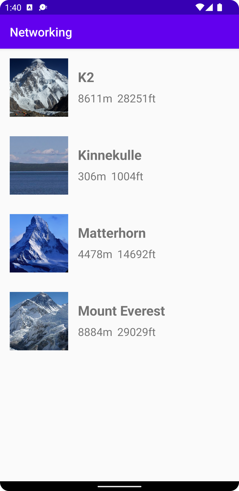

# Report

This assignment deals with the concept and practice of retrieving data from a source that is external to the application itself. Here, the data is not contained within some local file, but is instead provided as an HTTP response. To obtain the data, an asynchronous request is made to the API endpoint that is responsible for providing the data. Luckily, the code for making such a request is already present in the [JsonTask.java](https://github.com/b21mihpa/mobileapp-programming-networking/blob/master/app/src/main/java/com/example/networking/JsonTask.java) file.

## HTTP request

Since the MainActivity class in [MainActivity.java](https://github.com/b21mihpa/mobileapp-programming-networking/blob/master/app/src/main/java/com/example/networking/MainActivity.java) already extends **JsonTask**, all the tools that are required for making an HTTP request are readily available. The first step is to instantiate **JsonTask** and pass the URL of the API endpoint as an argument:

```java
new JsonTask(this).execute(JSON_URL);
```

After that, the `onPostExecute` method has to be implemented, as this method is called once the response has been received. This is necessary since there is no way to know in advance when the response will be received. Trying to access the data held within the response in a synchronous manner will not work, because there will be nothing to access. Therefore, execution is postponed until `onPostExecute` is explicitly called by **JsonTask**. This is why related code has been placed within the very same method:

```java
Gson gson = new Gson();
mountains = gson.fromJson(json, new TypeToken<ArrayList<Mountain>>(){}.getType());
```

It is known in advance that a successful HTTP response from this API endpoint will yield [JSON](https://www.json.org/json-en.html) type data, which contains various information about famous mountains. Although, the data within the response will consist of nothing more than a very long string. This is known as _serialized_ data, which entails that the data cannot easily be interpreted. That is why a third-party library known as **Gson** is employed to _deserialize_ the data into objects in Java. These objects are then pushed into an `ArrayList` of `Mountain` objects. Note that `Mountain` is the class that will reflect the key/value pairs contained within the JSON data.

### Mountain class

```java
public class Mountain {
    @SerializedName("ID")
    public String id;
    public String name;
    public String type;
    public String company;
    public String location;
    public String category;
    @SerializedName("size")
    public int meters;
    @SerializedName("cost")
    public int feet;
    public Auxdata auxdata;
}
```

## Passing mountains data to the RecyclerView

Once a successful HTTP response has been received, and the JSON data within that response has been deserialized into Java objects, the data can be passed onto a `RecyclerView`.

```java
recyclerView = findViewById(R.id.mountains);
mountainAdapter = new MountainAdapter(mountains);
recyclerView.setAdapter(mountainAdapter);
recyclerView.setLayoutManager(new LinearLayoutManager(this));
```

## MountainAdapter

To render the mountains onto the `RecyclerView`, the `MountainAdapter` class in [MountainAdapter.java](https://github.com/b21mihpa/mobileapp-programming-networking/blob/master/app/src/main/java/com/example/networking/MountainAdapter.java) extends `RecyclerView.Adapter`, which manages and updates the layout as the data changes. All the layout components are defined within the `MountainViewHolder` class, which also makes them accessible in the `onBindViewHolder` method.

```java
public class MountainViewHolder extends RecyclerView.ViewHolder {
    private ImageView mountain_image;
    private TextView mountain_name;
    private TextView mountain_height_meters;
    private TextView mountain_height_feet;

    public MountainViewHolder(@NonNull View itemView) {
        super(itemView);

        context = itemView.getContext();

        mountain_name = itemView.findViewById(R.id.mountain_name);
        mountain_image = itemView.findViewById(R.id.mountain_image);
        mountain_height_meters = itemView.findViewById(R.id.mountain_height_meters);
        mountain_height_feet = itemView.findViewById(R.id.mountain_height_feet);
    }
}
recycle
```

The components are then populated with the data that was obtained from the HTTP response. Note that `mountains` is an `ArrayList` of `Mountain` objects, where each object holds all the attributes that were deserialized from a JSON object at the same location in a JavaScript array.

```java
public void onBindViewHolder(@NonNull MountainAdapter.MountainViewHolder holder, int position) {
    Glide.with(context).load(mountains.get(position).auxdata.img).into(holder.mountain_image);

    holder.mountain_name.setText(mountains.get(position).name);
    holder.mountain_height_meters.setText((mountains.get(position)).meters + "m");
    holder.mountain_height_feet.setText((mountains.get(position)).feet + "ft");
}
```

Finally, since asynchronous programming is still a difficult topic for me in this language, the decision was made to employ yet another third-party library to retrieve image data from a URL. Here, the **Glide** library accepts the context of the `itemView` and a URL to some multimedia file (in this case a JPG image from **Wikipedia**). Once the data has been retrieved, the library then also updates the layout using the `into` method, which of course accepts a suitable layout component (in this case an `ImageView` component.)

<p align="center">
  
</p>
